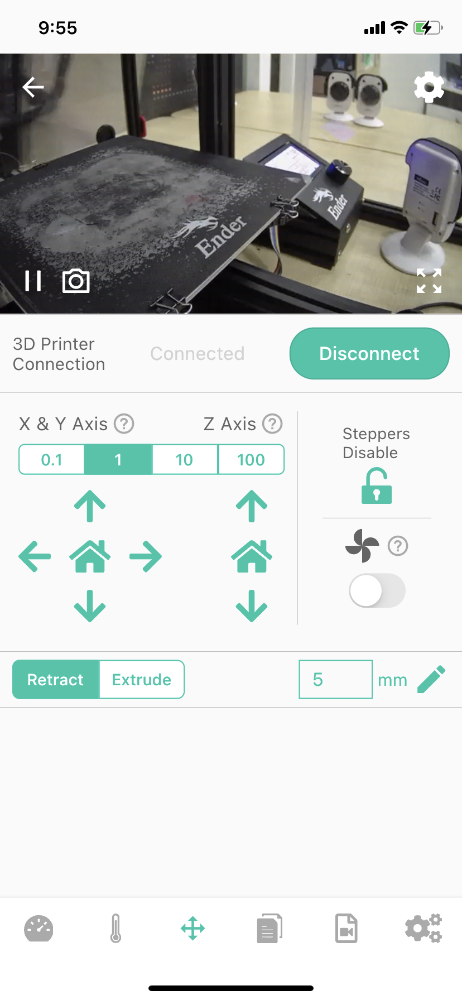
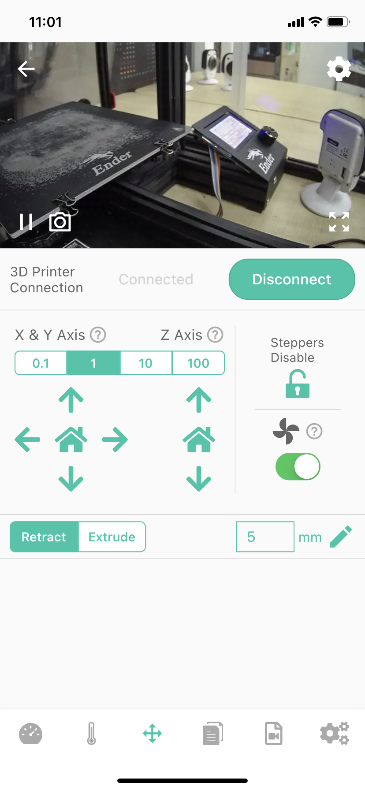

# Device-Control

The screen is an control screen displaying the work of the main motors and fans. They are the X, Y, Z, E controls for the distance and direction of motor movement (3, 4) and the controls for the printed model cooling fans (5).

|Fan Off|Fan On|
|-|-|
|||

1-Camera returns the video stream window, you can learn more about the printing situation (when you install the Camera next to the printer).

_Note:Back button in the upper left corner, Camera settings buttons in the upper right and lower right corners._

2-Status bar (Connected/Disconnected)

3-XYZ motor control-you can click the button to set the motion range, and let the printer perform the corresponding motion or return to zero.

4-E motor control-you can input and set the motion range of the E motor, and control the E motor to work by clicking the "Retract" button and the "Extrude" button.

5-Camera function button for connecting to the printer (Connect/Disconnect)

6-Steppers Disable - Click the icon button, you can unlock the locked state of all motors, so as to manually push the corresponding nozzle or hot bed to move.

7-Fan switch - control the fan on and off

---
### Next: [Device-Printable Files List](./Beagleprint%20Device%20Printable%20Files%20List.md)
