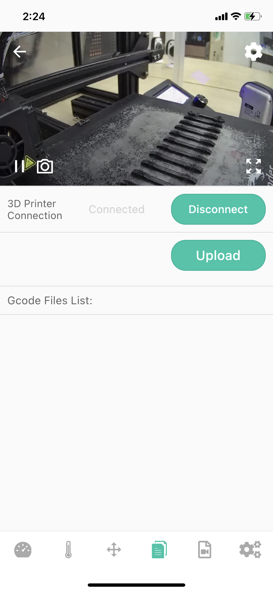
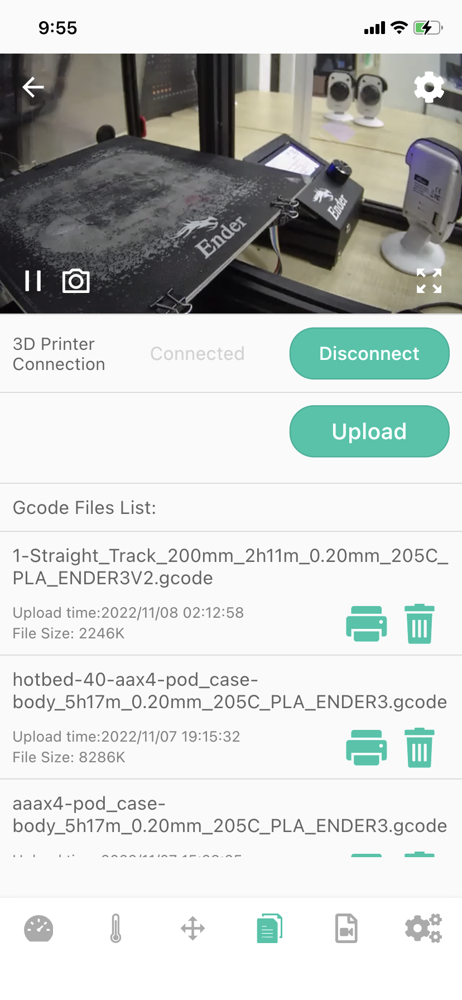

# Device-Printable Files List

The screen is an information&control screen displaying the Printable Files (including .GCODE .GCO .G suffix file) in the BeagleCamera Micro SD card. At the same time, you can select the Gcode file in the phone to upload, and control the printing and deletion of the file.

|Generally|After uploading the file|
|-|-|
|||

1-Camera returns the video stream window, you can learn more about the printing situation (when you install the Camera next to the printer).

_Note:Back button in the upper left corner, Camera settings buttons in the upper right and lower right corners._

2-Status bar (Connected/Disconnected)

3-Progress of Uploading files in%-shown only during the printing

4-Gcode Files List-You can view the file name, upload time, and file size information of the uploaded file, and at the same time, you can print it (button) or delete the file (button, pop-up confirmation).

5-Camera function button for connecting to the printer (Connect/Disconnect)

6-Upload file button - Click the button, you can select the corresponding Gcode file (including .GCODE .GCO .G suffix file) from "Mobile Phone" and "iCloud Drive" to upload to Camera Micro SD card.

---
### Next: [Device-Video list](./Beagleprint%20Device%20Video%20list.md)
