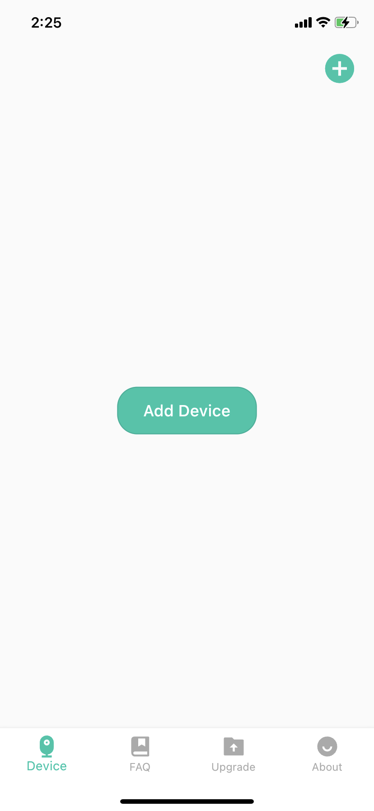
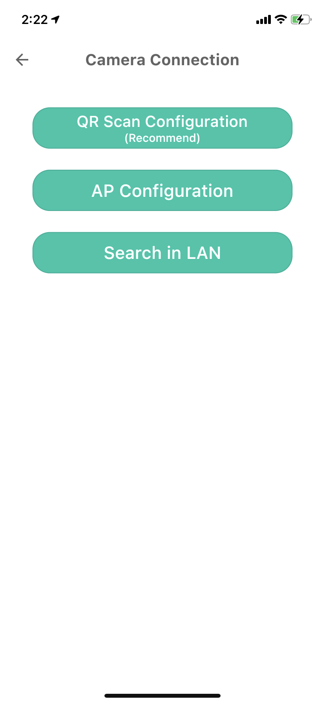
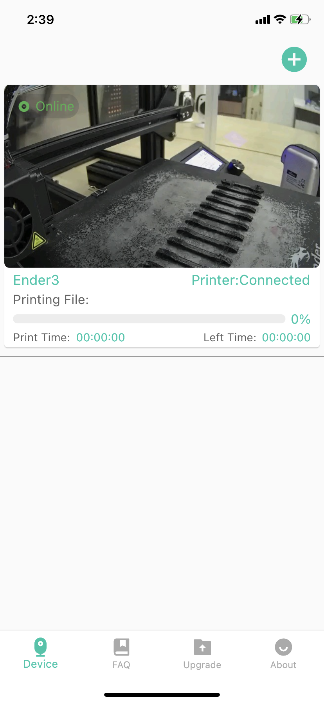
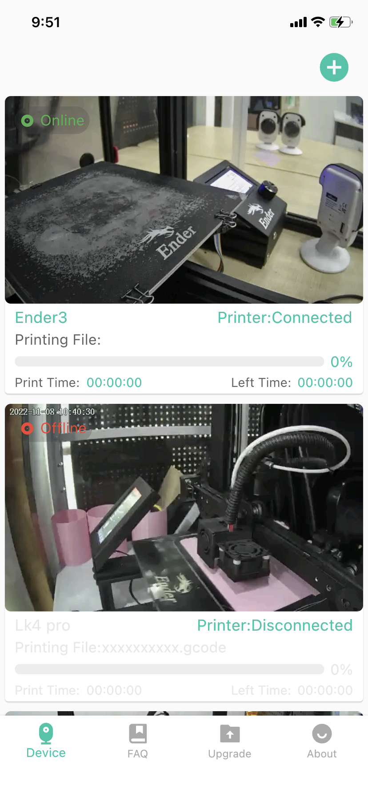
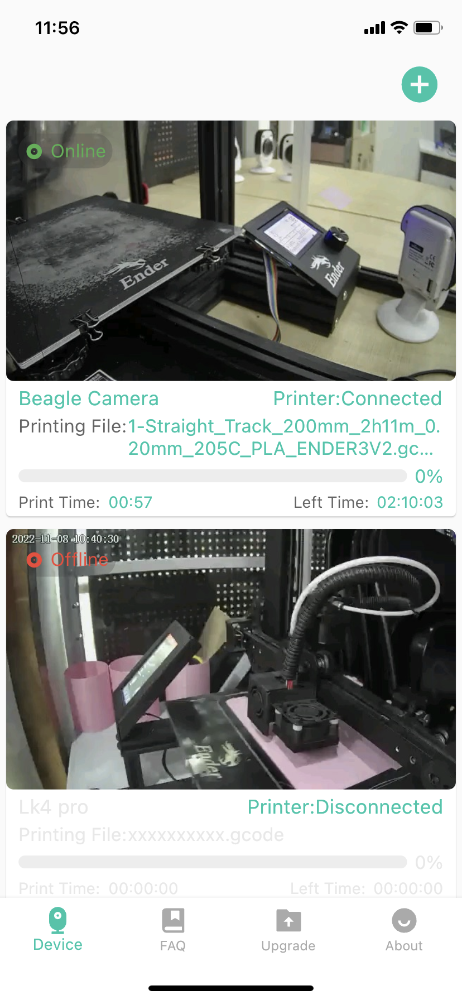
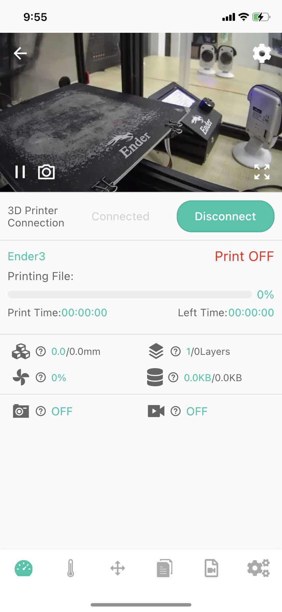
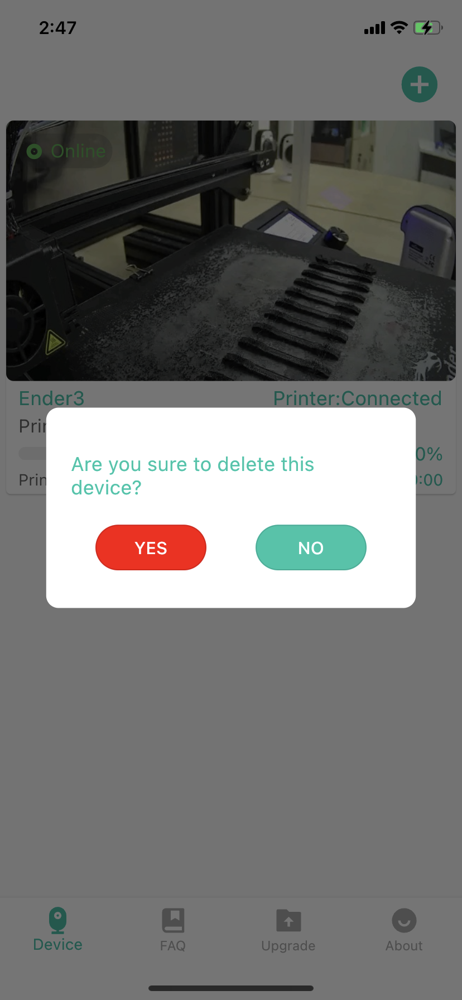

# Desktop-Device

When you open the Beagleprint APP, this is the home page that the app shows you (of course, if you are using it for the first time, or if you have not registered and set "remember account", you may be on the login page.

### Add device

You can find the button of the device in the upper right corner, or click the "Add Device" button on the screen to add Camera. There are also some "FAQ", "Upgrade", "About" pages at the bottom.

|Home|Camera connect|
|-|-|
|||

### Device View

When you have finished adding Camera, The screen is an information screen displaying the most important details. They are the Printer(1) , Printing File Name (2) and Printing Progress Information (3, 4, 6).. When you add multiple devices (single page, you can view 2 Cameras at the same time), you can try to swipe the page to browse.

|One|Multi|Printing|
|-|-|-|
||||

1- Device status (Online/Offline, this is based on whether Beagleprint can find the Camera in the server)

2- Printer name(You can define this parameter in Printer Settings.)

3- Printing File Name

4- Progress of printing in % -shown only during the printing

5- Printed time

6- Printer connection status

7- Remaining printing time

### Enter the Camera control screen

You can click on the device to enter the device's control screen.

|Device|Dash board|
|-|-|
|||

### Device Management - Delete Camera

You can touch a single device for 3 seconds to trigger a pop-up window to confirm the deletion of the device. After selecting Yes, Camera will release the binding relationship with your login account (but Camera is still connected to the Internet, and the account and password information for connecting to the Internet are still retained). Select "No" to return to the "Device" page.

|Device|Dash board|
|-|-|
|||

---
### Next: [Desktop-FAQ](./Beagleprint%20FAQ.md)
