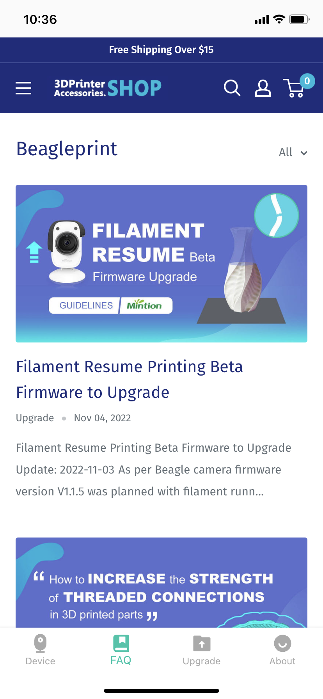

# Desktop-FAQ

This layout will show some guide articles from [Beagleprint Guidelines](https://www.3dprinteraccessories.shop/blogs/beagleprint), such as "How to improve the spotting and stringing problems caused by time-lapse photography?"

|Device|FAQ|
|-|-|
|||

---
### Next: [Desktop-Upgrade](/Beaglecam/docs/Manual/Beagleprint%20Upgrade.md)
