# Device-Camera setting

Click the settings icon in the upper right corner to enter the Camera settings page,
The screen is an Camera settings screen displaying many Camera function settings such as "Normal Record Setting", Timelapse Setting and Firmware Upgrade, etc.

|Generally|New firmware|
|-|-|
|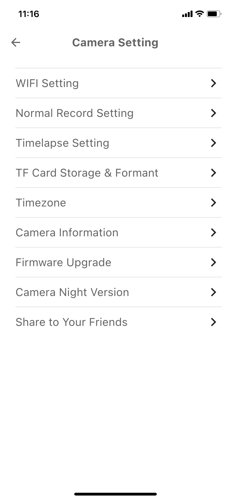|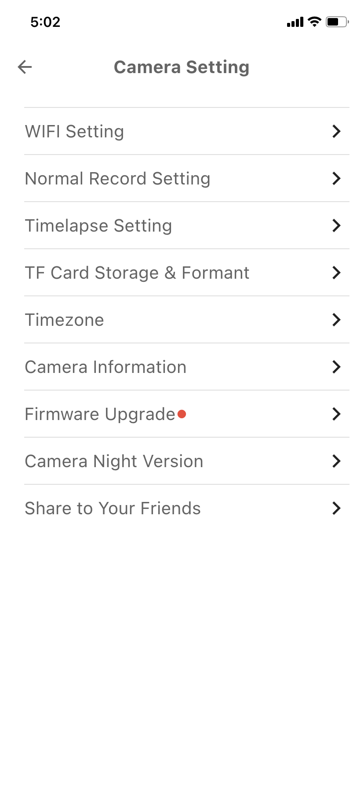|

1- Back icon, function button to return to the previous page.

2-Wi-Fi Setting- You can use this setting to switch the Wi-Fi connected to the Camera.

3-Normal Record Setting-Camera recording function, you can set the opening and closing of the video and audio recording function.

4-Timelapse Setting-time-lapse photography function on and off, mode and corresponding parameter settings

5-TF Card Storage & Formant-Camera Micro SD card storage and formatting settings.

6-Timezone-Display and hide the time zone setting of the timestamp in the upper left corner of the video window.

7-Camera Information-Camera basic information, such as P2Pid, firmware version and networking information

8-Firmware-Upgrade-Online upgrade function, this option can know the current Camera firmware version, the latest Camera firmware details and the button to update the firmware.

9-Camera Night Version-Camera night vision mode setting, the default is black and white night vision.

10-Share to Your Friends-Device sharing settings, you can share Camera through each other's username, so that multiple devices can view the same Camera device.

## Supplementary notes

### Timelapse Setting-time

The time-lapse photography function has three states, namely "Clean Timelapse Video", "Normal Timelapse Video" and "OFF".

|Generally|Not move the nozzle|Turn off Timelapse|
|-|-|-|
|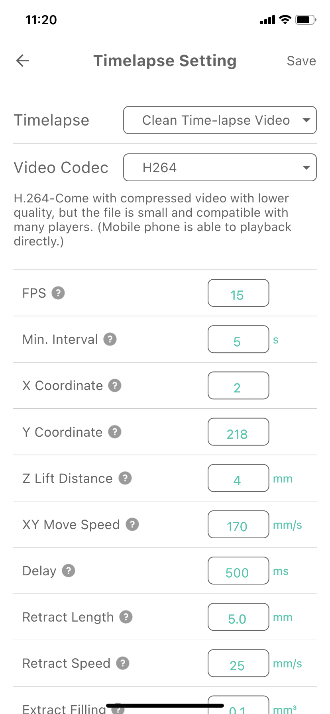|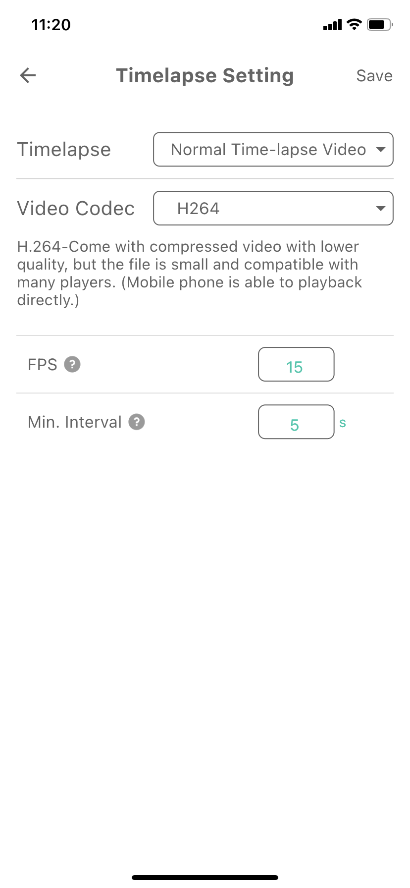|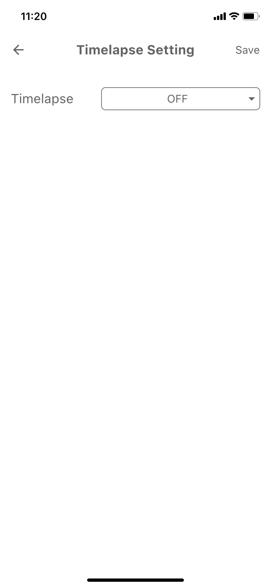|

4.1-Time-lapse photography mode/off option,

4.2- Time-lapse photography video format selection, H264 is compatible with most players, and MJPEG format can obtain higher definition, but there are few players that support playback.

4.3- These are some detailed setting parameters, which may be displayed differently depending on the mode

FPS-Video frames per second, default is 15, that is 15 images in one second.

Min Inr Secs-Capture image minimum interval seconds, especially for vase model to avoid printing quality.

X Coordinate-
The hot end moves X axis aside to the coordinate when capturing an image.
Default number: Cartesian: 2, CoreXY: 2, Delta: Max/2-2

Y Coordinate-
The hot bed moves Y axis aside to the coordinate when capturing an image.
Default number: Cartesian: Max-2, CoreXY: Max-2, Delta: 0

Z Lift Distance-
Z axis lift distance when capturing image, the default number is 0.

XY Move Speed-
The XY axis moves speed aside when capturing the image.

Delay-
The duration to wait to capture by the Beagle camera when the XY axis moves aside.

Retract Length-
The retract filament length when the hot end is moving aside.
Recommend number: Direct drive extruder: 3mm; Bowden Extruder: 5mm.

Retract Speed-
The retract speed when the hot end is moving aside.
Recommend number: Direct drive extruder: 35mm/s; Bowden Extruder: 45mm/s.

Extra Filling-
The filament extra filling volume when the Beagle camera is capturing.

Filling Speed-
The filament filling speed when the hot end is moving back.
Recommend number: Direct drive extruder: 35mm/s; Bowden Extruder: 45mm/s.

### Camera Information

In addition to displaying some basic information, there are three buttons at the bottom, namely soft reset Camera (with or without Wi-Fi information), Restart Camera restart Camera soft button

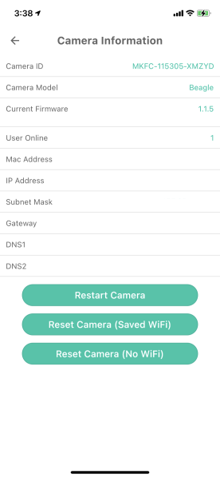

### Firmware-Upgrade

When you have the latest firmware, the page will display "The Firmware is the latest now"

|Firmware is not up to date|Firmware is up to date|
|-|-|
|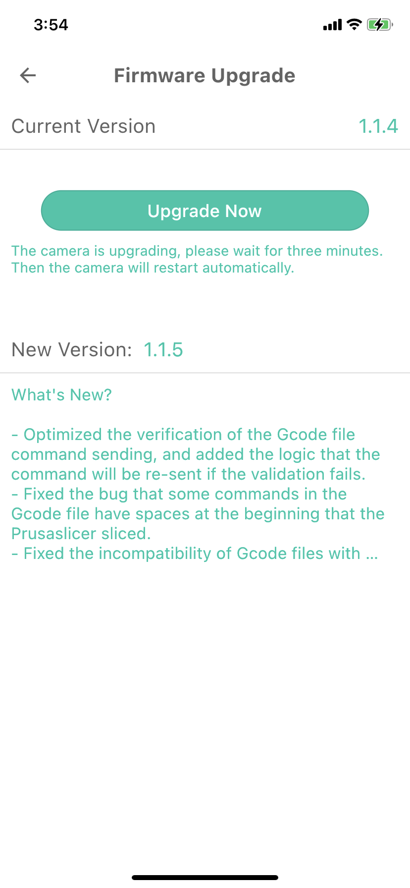|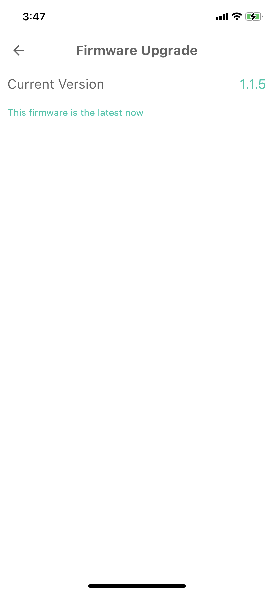|

### Share to Your Friends

Complete Camera sharing by clicking the "+" icon and entering the other party's nickname in the pop-up window.

|Generallye|After sharing the device|
|-|-|
|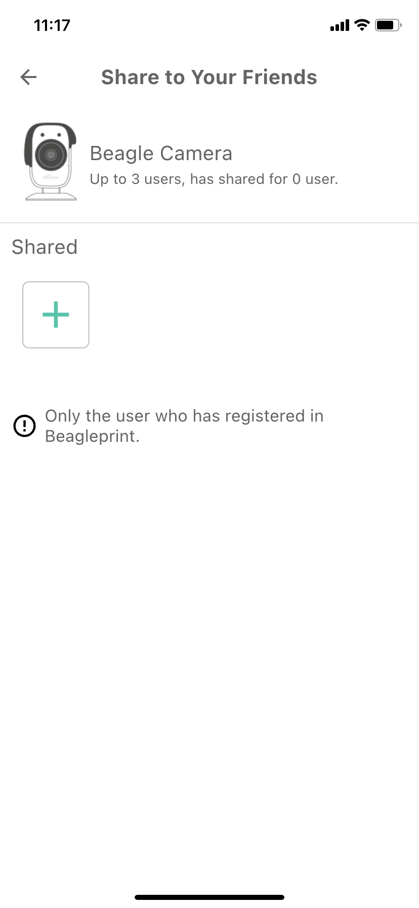|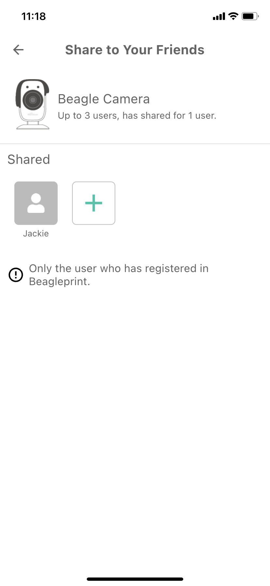|

### Camera Night Version

Night vision function, there are two modes, color night vision, slight ambient light source, can display color pictures. Black and white night vision, low ambient light source, switch modes, and get better viewing images. There is no best model, only the model that works for you.

|Generallye|Color Night Version|
|-|-|
|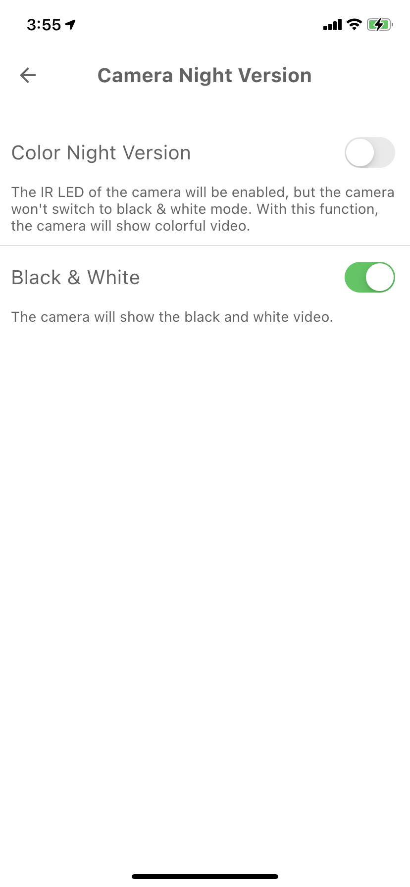|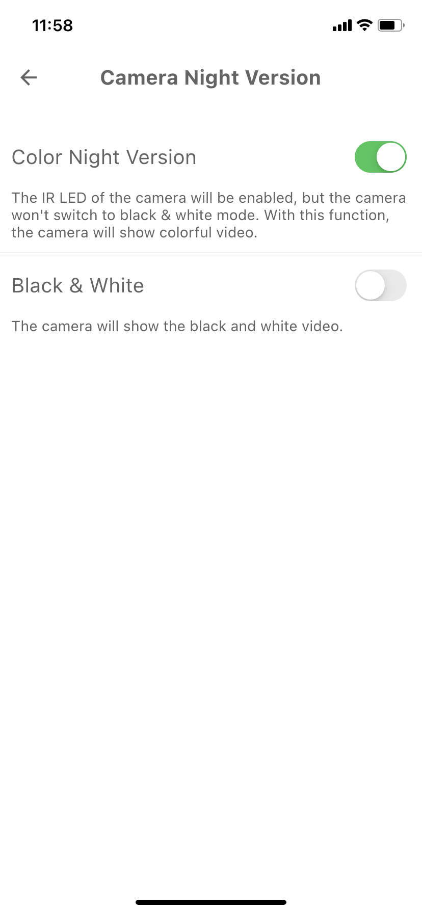|

---
### Next: [Device-Video window](./Beagleprint_Device_Video_window.md)
