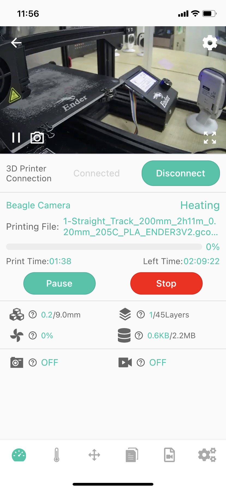

# Device-Dash board

The screen is an information screen displaying the most important details. They are the video stream returned by the Camera (1), Printer connection status (1) printing progress information (3, 4, 6) and feature on status.

|Dash board|Dash board-Printing|
|-|-|
|||

1-Camera returns the video stream window, you can learn more about the printing situation (when you install the Camera next to the printer).

_Note:Back button in the upper left corner, Camera settings buttons in the upper right and lower right corners._

2-Status bar (Connected/Disconnected)

3- Printer name, BeagleCamera by default (you can modify it in the printer settings)

4- print filename, -shown only during the printing

5-Progress of printing in %-shown only during the printing

6- Printed time, you can see how long the current printing task has been

7-Model height (actual/desired height)

8-fan speed in %

9-Time-lapse photography function ON status (ON/OFF)

10-Camera function button for connecting to the printer (Connect/Disconnect)

11-Printing status (Print OFF-just no current printing task, printing-printing in progress, etc.)

12.Left Time-Estimated remaining print time

13 - Model layers (actual/desired height)

14 - file size (actual/desired size)

15-Normal video recording function on state (ON/OFF)

---
### Next: [Device-Temperature](./Beagleprint_Device_Temperature.md)
