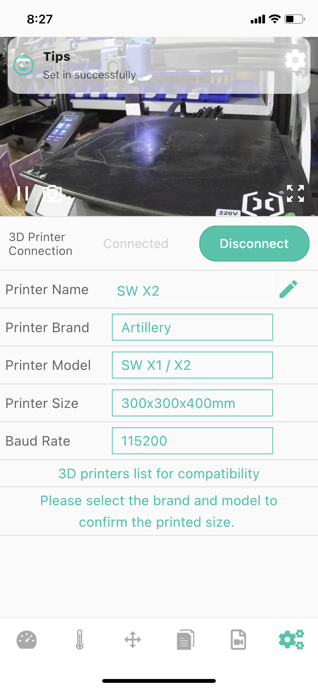

# Device-Printer settings

The screen is an Printer settings screen displaying the most important settings. The Camera needs you to tell it the model of the printer it is connected to, especially the format information, which affects how the "Clean Time-lapse Video" mode works in time-lapse photography.

|Generally|Modify the printer name|Artillery SW X2|
|-|-|-|
||||

1-Camera returns the video stream window, you can learn more about the printing situation (when you install the Camera next to the printer).

_Note:Back button in the upper left corner, Camera settings buttons in the upper right and lower right corners._

2-Status bar (Connected/Disconnected)

3-Printer Name-This item is mainly displayed on the main screen and Dash board pages, which will help you identify the model of the camera connected to the printer, and you can customize the name.

4-Printer Brand-Click the box to select the brand of your printer manufacturer. If you don't find it in the list, you can set "Custom" to customize it.

5-Printer Model - Click the box to select your printer model information.

6-Printer Size - This is the size that is automatically loaded according to the printer's printing format parameters announced by the brand manufacturer. If you select the "Custom" brand, you need to click the box to enter the corresponding printing format information.

7-Baud Rate - The correct baud rate has an impact on the successful connection of the Camera to the Camera. Click the box to select the corresponding baud rate.

_Note: After V1.1.1 Camera firmware, automatic baud rate matching is built-in, so you can ignore this setting._

8-Camera function button for connecting to the printer (Connect/Disconnect)

9-Modify the Printer Namera button-Click the button to modify, after the Printer Name is modified, pay attention to click the icon on the right twice until it changes to a pencil icon, and the modification is successful.

### Key Details

After the parameters such as Printer Brand/Printer Model are modified, a save button will appear below it, click and receive a prompt "saved successfully", the modification is successful.

|Not saved|Saved|
|-|-|
|||

---
### Next: [Device-Camera setting](./Beagleprint_Device_Camera_settings.md)
