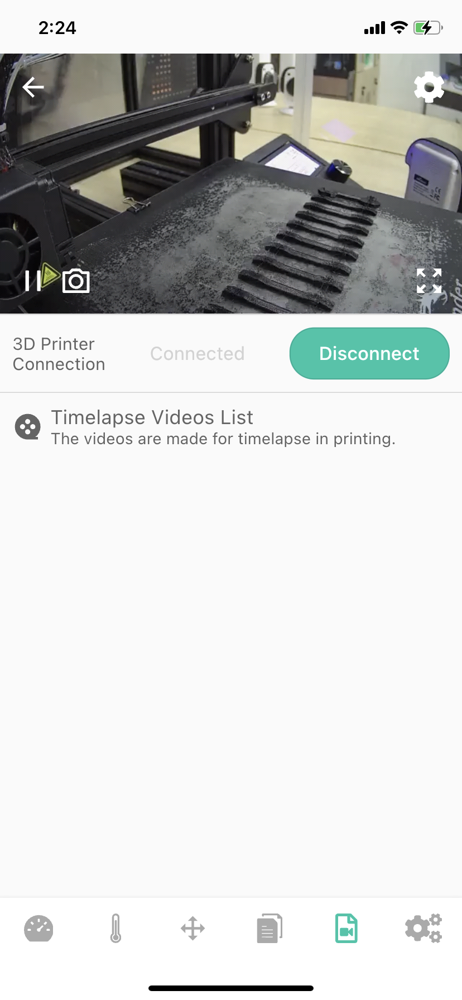

# Device-Video list

The screen is an information&control screen displaying the video files in the BeagleCamera Micro SD card (currently, only time-lapse video is supported), at the same time, you can select time-lapse video to download and delete.

|Generally|After generating video|
|-|-|
|||

_Note: The MJPEG format in the time-lapse video may not be played in the default player of the phone._

1-Camera returns the video stream window, you can learn more about the printing situation (when you install the Camera next to the printer).

_Note:Back button in the upper left corner, Camera settings buttons in the upper right and lower right corners._

2-Status bar (Connected/Disconnected)

3-Video Files List-You can view the file name, Generation time, and file size information of the List, and at the same time, you can Download it (button) or delete the file (button, pop-up confirmation).

4-Camera function button for connecting to the printer (Connect/Disconnect)

---
### Next: [Device-Printer settings](./Beagleprint_Device_Printer_settings.md)
