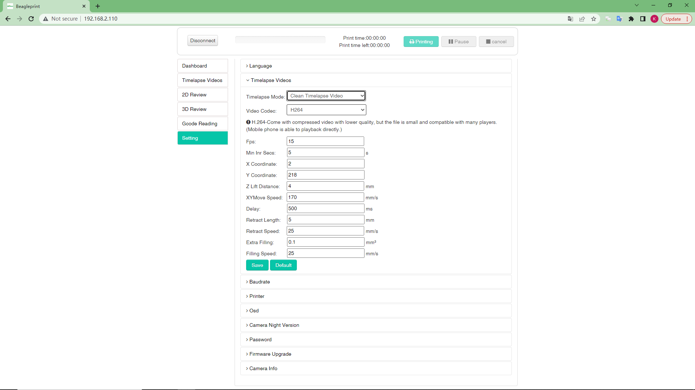

# Setting

The screen is an Camera settings screen displaying many Camera function settings such as "Normal Record Setting", Timelapse Setting and Firmware Upgrade, etc.

1-Language-The voice type of the content displayed on the Browser Page layout, currently only supports English

4-Timelapse Setting-time-lapse photography function on and off, mode and corresponding parameter settings

5-Baudrate-Two parameters Port & Baudrate settings that affect the serial connection of the Camera and the printer.

6-Printer-Set the Printer Brand and Printer Model of the Camera connected to the printer, and check whether the generated Printer Size is correct, this setting may affect whether the "Clean Timelapse Video" mode works normally.

6-Osd-Display and hide the time zone setting of the timestamp in the upper left corner of the video window.

9-Camera Night Version-Camera night vision mode setting, the default is black and white night vision.

10-Password-Change of password in Browser Page layout login page

8-Firmware-Upgrade-Online upgrade function, this option can know the current Camera firmware version, the latest Camera firmware details and the button to update the firmware.

7-Camera Information-Camera basic information, such as P2Pid, firmware version and networking information

## Supplementary notes

### Timelapse Setting-time

The time-lapse photography function has three states, namely "Clean Timelapse Video", "Normal Timelapse Video" and "OFF".

|Clean Timelapse Video|OFF| 
|-|-|
|||

4.1-Time-lapse photography mode/off option,

4.2- Time-lapse photography video format selection, H264 is compatible with most players, and MJPEG format can obtain higher definition, but there are few players that support playback.

4.3- These are some detailed setting parameters, which may be displayed differently depending on the mode

FPS-Video frames per second, default is 15, that is 15 images in one second.

Min Inr Secs-Capture image minimum interval seconds, especially for vase model to avoid printing quality.

X Coordinate-
The hot end moves X axis aside to the coordinate when capturing an image.
Default number: Cartesian: 2, CoreXY: 2, Delta: Max/2-2

Y Coordinate-
The hot bed moves Y axis aside to the coordinate when capturing an image.
Default number: Cartesian: Max-2, CoreXY: Max-2, Delta: 0

Z Lift Distance-
Z axis lift distance when capturing image, the default number is 0.

XY Move Speed-
The XY axis moves speed aside when capturing the image.

Delay-
The duration to wait to capture by the Beagle camera when the XY axis moves aside.

Retract Length-
The retract filament length when the hot end is moving aside.
Recommend number: Direct drive extruder: 3mm; Bowden Extruder: 5mm.

Retract Speed-
The retract speed when the hot end is moving aside.
Recommend number: Direct drive extruder: 35mm/s; Bowden Extruder: 45mm/s.

Extra Filling-
The filament extra filling volume when the Beagle camera is capturing.

Filling Speed-
The filament filling speed when the hot end is moving back.
Recommend number: Direct drive extruder: 35mm/s; Bowden Extruder: 45mm/s.

### Printer

If you don't find it in the list, you can set "Custom" to customize it

### Firmware-Upgrade

When you have the latest firmware, the page will display "The Firmware is the latest now"

|Firmware is not up to date|Firmware is up to date|
|-|-|
|||

### Camera Information

In addition to displaying some basic information, there are three buttons at the bottom, namely soft reset Camera (with or without Wi-Fi information), Restart Camera restart Camera soft button

### Save

After the parameters such as Camera Night Version are modified, don't forget to click the save button to complete the modification.

---