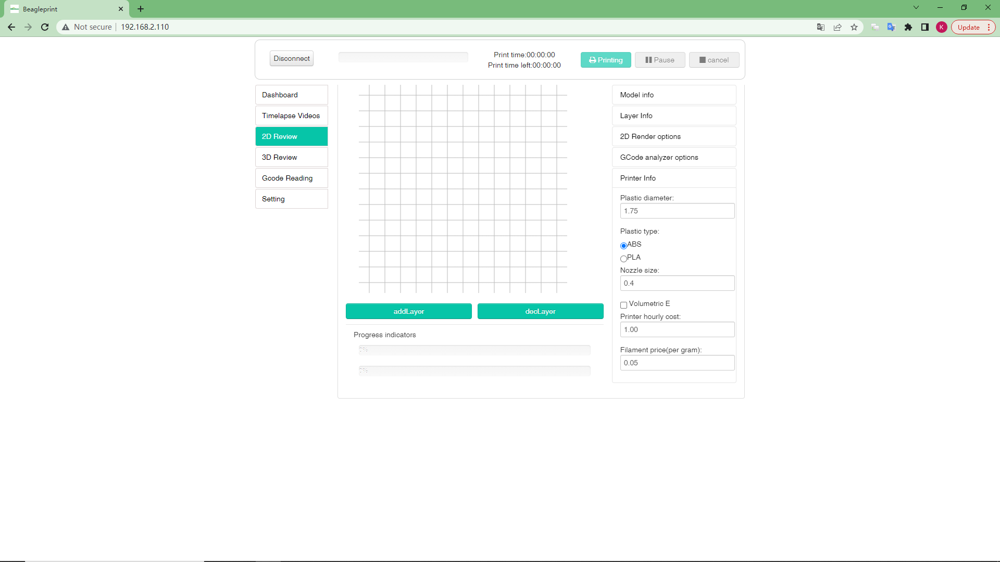
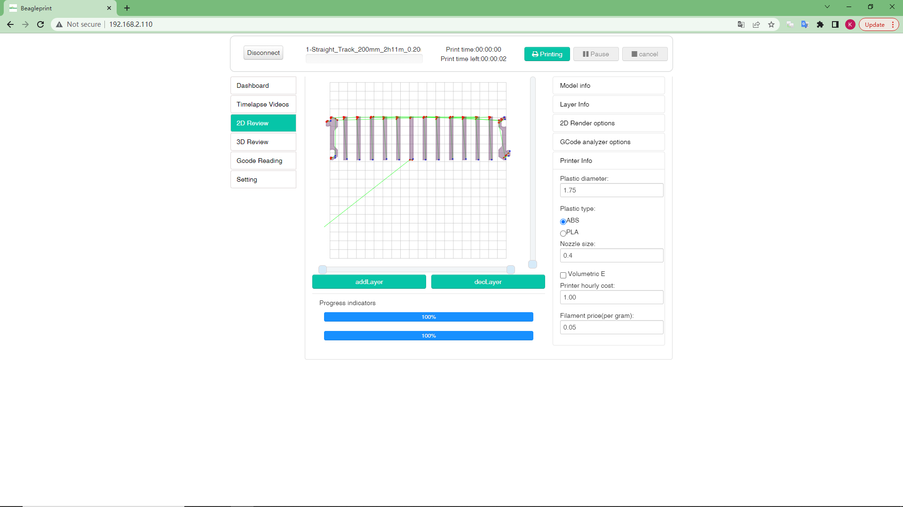
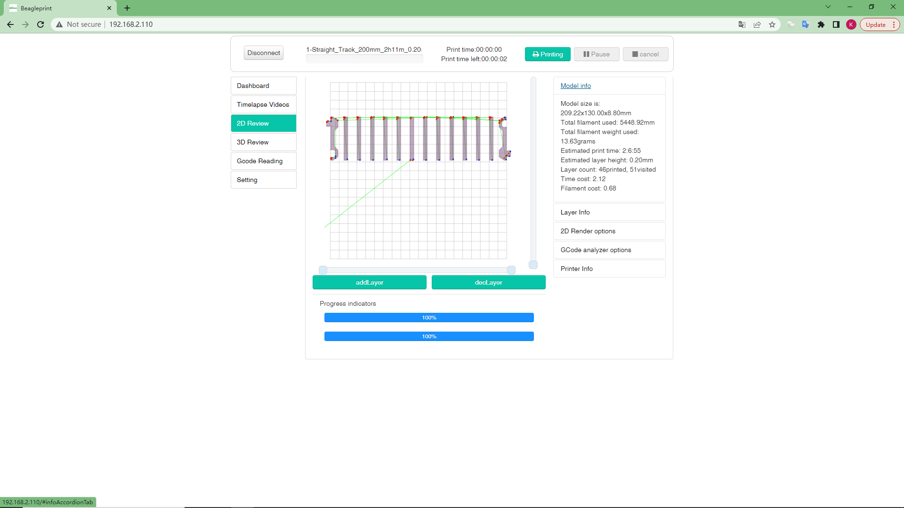
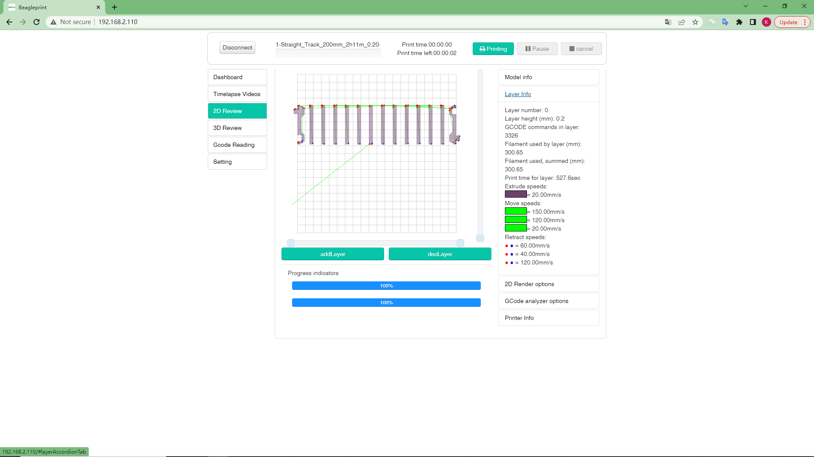
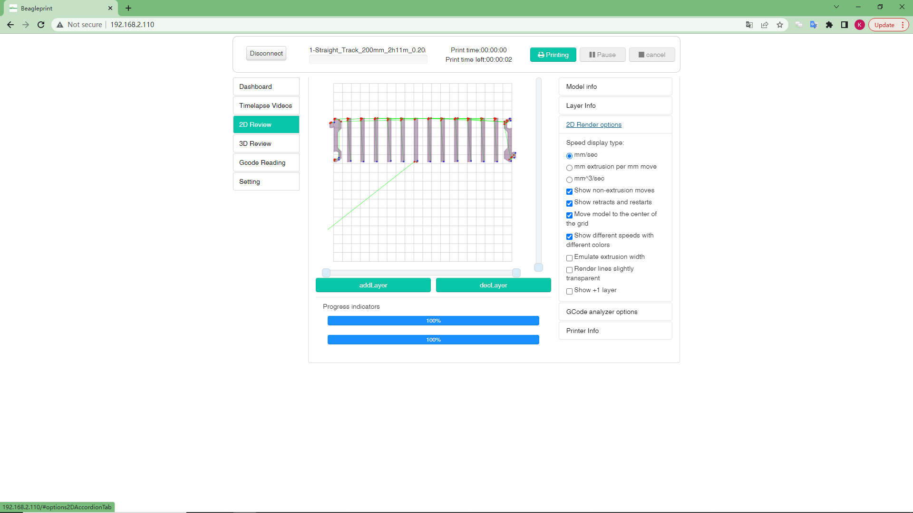
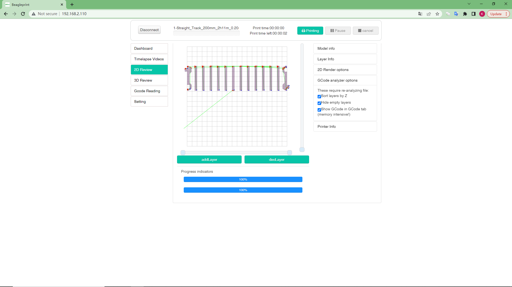

# 2D Review

This is a Gcode file preview page (2D), you can use this page to quickly check the layer status, motion track, speed and other information of the Gcode file.

|Generally|After Load/print File|
|-|-|
|||

1- Horizontal slider - drag the slider to check the printing order of the nozzles of this layer

2-add Layer-Click the button to view the printing layer information of the next layer (printing order).

3-decLayer-click the button to view the print layer information of the previous layer (print order).

4-Progress indicators-The progress bar of the details of the loading file.

9-Printer info-This setting is mainly printer information and consumables specification information, etc., so as to display some cost information in the Model info column.

|Model info|Layer info|
|-|-|
|||

5-Model info- Information about model size, material length type, printing time, layer height, number of layers, material cost, time cost, etc.

6-Layer info-about the current layer height, the total number of layers, the Gcode command used in the layer, the length of the filament consumed by the current layer, the printing time of the current layer, the speed identification of the current layer extrusion, movement, and withdrawal of the filament, etc.

|Option|Analyzer options|
|-|-|
|||

7-2D Render options- You can get the best viewing effect by modifying the settings such as Speed ​​display type, Emulate extrusion width, Render lines slightly transparent, Show +1 layer, etc.

8-GCode analyzer options- These are options for GCode analysis settings such as collation, empty layer processing, etc. After each modification, the file needs to be reloaded.

_Note:In order to keep the content brief, the same content items will not be described again here. If you have any doubts, you can refer to the previous layout introduction._

---
### Next: [3D Review](/Beaglecam/docs/Manual/Browser%20Page%20layout-3D%20Review.md)