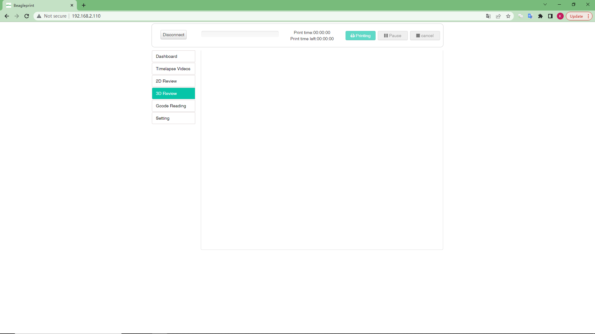
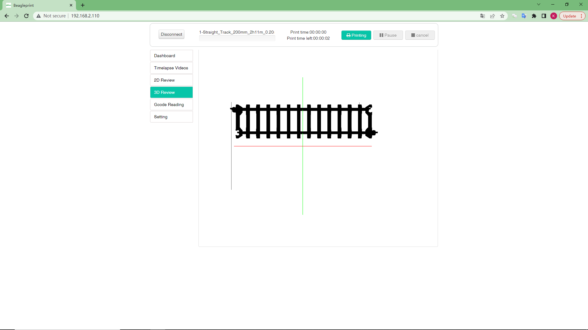

# 3D Review

This is a Gcode file preview page (3D), you can use this page to quickly check the model appearance information of the Gcode file.

|Generally|After Load/print File|
|-|-|
|||

Operation method, move the mouse to the frame.

1- Hold down the left mouse button, move the table, rotate the model.

2- Press and hold the right mouse button, move the mouse, move the model.

3- Press and hold the middle mouse button, move the mouse, zoom the model.

4- Scroll the middle mouse button to zoom the model.

_Note:In order to keep the content brief, the same content items will not be described again here. If you have any doubts, you can refer to the previous layout introduction._

---
### Next: [Gcode Reading](/Beaglecam/docs/Manual/Browser%20Page%20layout-Gcode%20Reading.md)