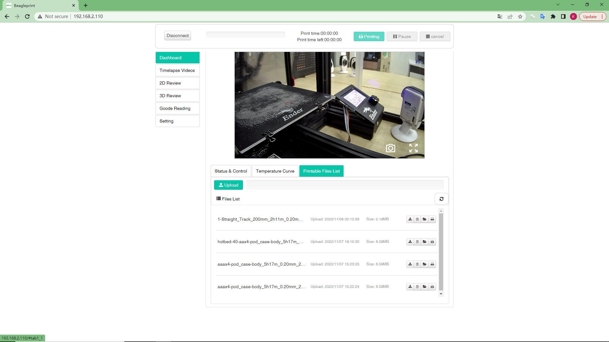

# Dashboard-Printable Files List

The screen is an information&control screen displaying the Printable Files (including .GCODE .GCO .G suffix file) in the BeagleCamera Micro SD card. At the same time, you can select the Gcode file in the phone to upload, and control the printing and deletion of the file.

3-Progress of Uploading files in%-shown only during the printing

4-Gcode Files List-You can view the file name, upload time, and file size information of the uploaded file, and at the same time, you can print it (button) or delete the file (button, pop-up confirmation).

6-Upload file button - Click the button, you can select the corresponding Gcode file (including .GCODE .GCO .G suffix file) from "Mobile Phone" and "iCloud Drive" to upload to Camera Micro SD card.

4-Refresh button - After this button is clicked, Camera will scan the Gcode file in the Micro SD card again and update it to

_Note:In order to keep the content brief, the same content items will not be described again here. If you have any doubts, you can refer to the previous layout introduction._

---
### Next: [Timelapse Videos](./Browser_Page_layout_Timelapse_Videos.md)