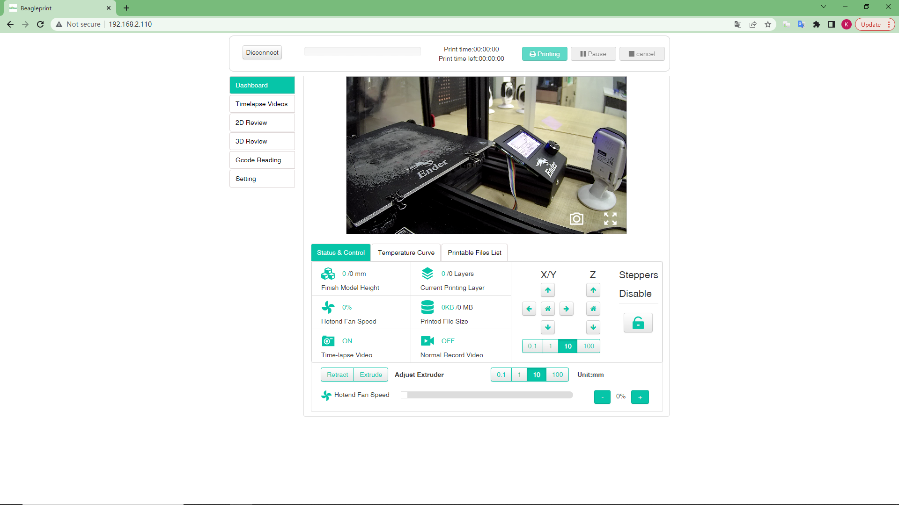
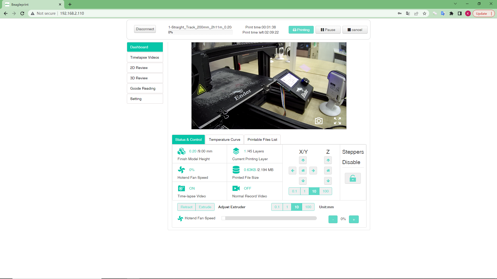

# Dashboard-Status & Control

The screen is an information screen && control screen displaying the most important details. They are the video stream returned by the Camera (1), Printer connection status (1) printing progress information (3, 4, 6), the X, Y, Z, E controls for the distance and direction of motor movement (3, 4), the controls for the printed model cooling fans (5) and feature on status.

1-Camera returns the video stream window, you can learn more about the printing situation (when you install the Camera next to the printer).

_Note:Back button in the upper left corner, Camera settings buttons in the upper right and lower right corners._

2-Status bar (Connected/Disconnected)5-Camera function button for connecting to the printer (Connect/Disconnect)

3-Timelapse Video-Video Files List

4.2D Review-Browsing Gcode files in 2D plane

5.3D review-3D view Gcode file

6.Gcode Reading-View Gcode files in text document mode

7.Setting-Camera and Printer settings

7-Model height (actual/desired height)

8-fan speed in %

9-Time-lapse photography function ON status (ON/OFF)

10-Camera function button for connecting to the printer (Connect/Disconnect)

11-Printing status (Print OFF-just no current printing task, printing-printing in progress, etc.)

12 - Model layers (actual/desired height)

13 - file size (actual/desired size)

14-Normal video recording function on state (ON/OFF)

3-XYZ motor control-you can click the button to set the motion range, and let the printer perform the corresponding motion or return to zero.

4-E motor control-you can input and set the motion range of the E motor, and control the E motor to work by clicking the "Retract" button and the "Extrude" button.

6-Steppers Disable - Click the icon button, you can unlock the locked state of all motors, so as to manually push the corresponding nozzle or hot bed to move.

7-Fan switch - control the fan in %

## During the printing process

During/after printing, you can see the print file name, printer progress, printing time, remaining printing time and other parameters.

During the printing process, the control of the motor and fan will become unavailable.

3- Printer name, BeagleCamera by default (you can modify it in the printer settings)

4- print filename, -shown only during the printing

5-Progress of printing in %-shown only during the printing

6- Printed time, you can see how long the current printing task has been

12.Left Time-Estimated remaining print time

---
### Next: [Dashboard-Temperature Curve](./Browser_Page_layout_Dashboard_Temperature_Curve.md)