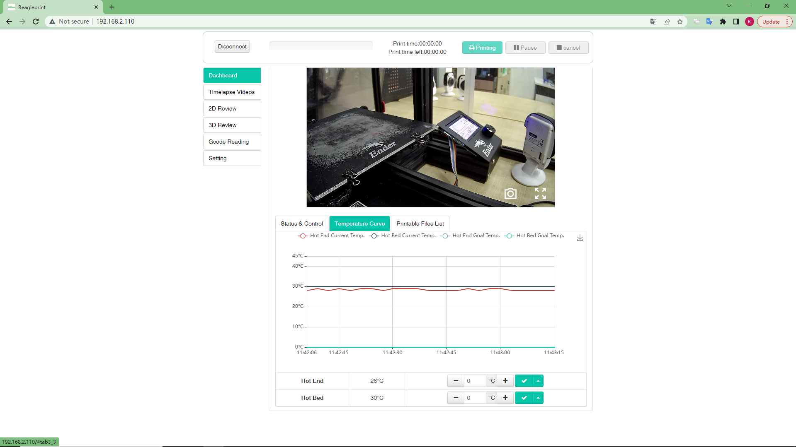
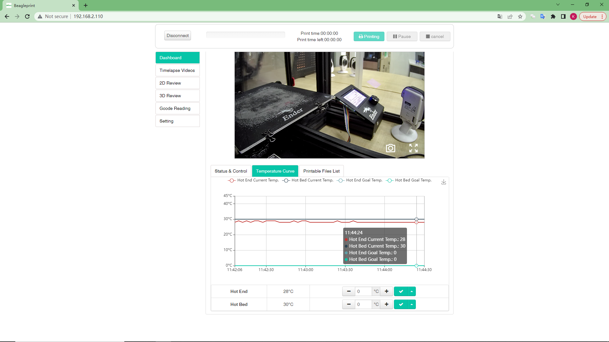
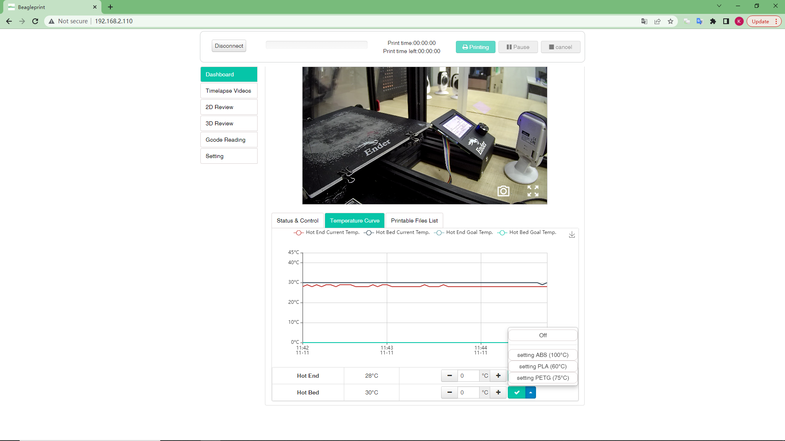
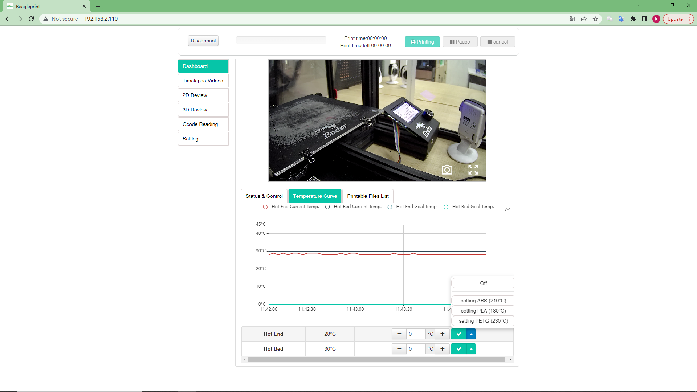

# Dashboard-Temperature Curve

The screen is an information&control screen displaying the actual/desired temperature of the sprinkler and hotbed. They are the desired temperature of the sprinkler & heated bed that can be entered (3, 4) and the actual temperature of the sprinkler & heated bed is known from the temperature graph (5 ).

3-Hot End Temperature-you can set the target temperature you want the Hot End to heat

4-Hot Bed Temperature-you can set the target temperature you want the Hot Bed to heat

5-Temperature curve-you can view the target temperature and actual temperature changes

## View real-time temperature

## set temperature

|Set hotbed Temperature|Set hotend Temperature|
|-|-|
|||

_Note:In order to keep the content brief, the same content items will not be described again here. If you have any doubts, you can refer to the previous layout introduction._

---
### Next: [Dashboard-Printable Files List](./Browser_Page_layout_Dashboard_Printable_Files_List.md)