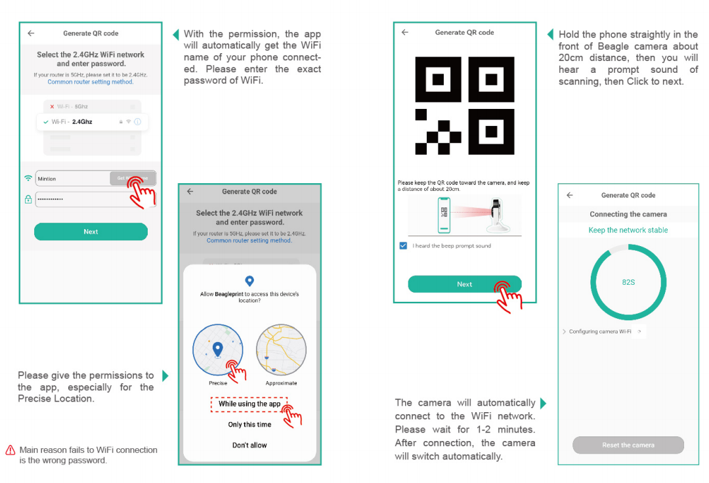

# QR Scan configuration

You can refer to the steps below to connect the camera to the network. [Instructional video](https://www.youtube.com/watch?v=5CNSH_D5_YE&list=PLSc0XAQ8RossfF7Z-SkeIvYP2vs1O8vf-&index=2){: .btn .btn-green .mr-4 }

[Having trouble with QR Scan configuration?](/Beaglecam/docs/FAQ)

----

### Next: [Set The Printer Model](/Beaglecam/docs/Quick%20Start%20for%20Beagle%20Camera/Set%20The%20Printer%20Model.md)
