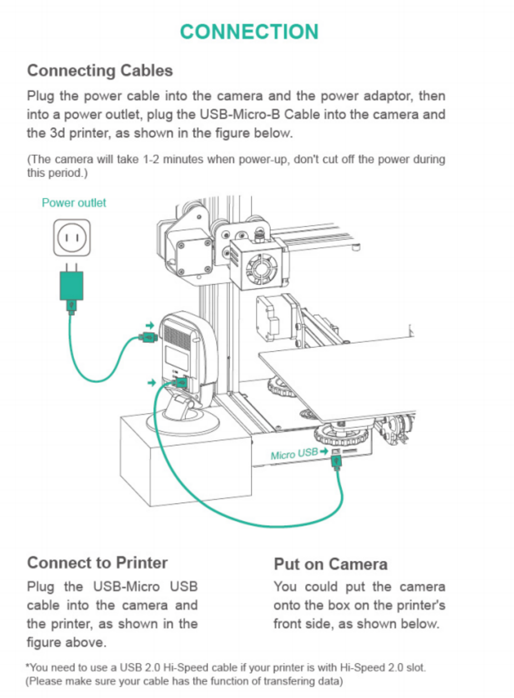

# Install the cable

You can learn about the Camera's cable installation, the Camera's power supply and the Camera's connection to the printer through the following content.[Instructional video](https://www.youtube.com/watch?v=g_8H3cEa7V0&list=PLSc0XAQ8RossfF7Z-SkeIvYP2vs1O8vf-&index=4){: .btn .btn-green .mr-4 }

_Note: Before connecting the Camera to the printer, make sure the printer is turned on_

----
### Next: [Install Beagleprint](../Install%20Beagleprint/index.md)
