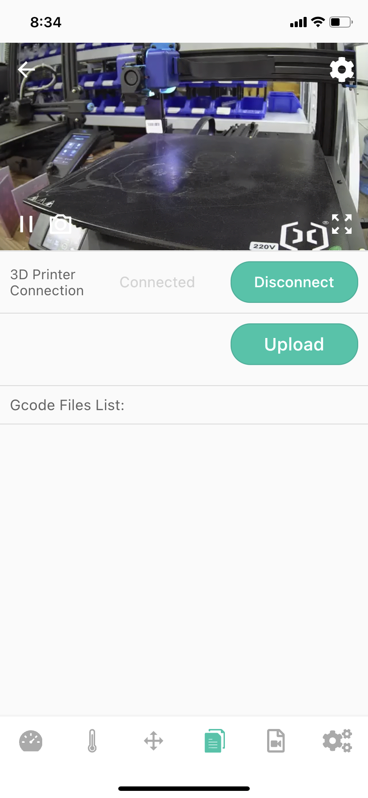
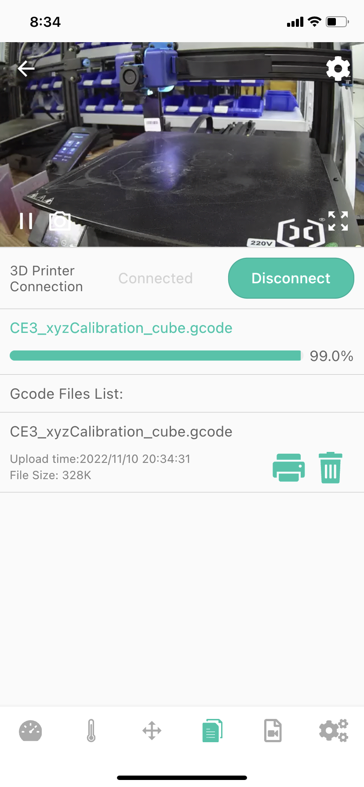

# Upload Gcode File

Camera currently supports uploading Gcode files to the Camera's Micro SD card through the Camera, and starts printing. Printing through the printer's Micro SD card will lose the Camera remote control and time-lapse video generation functions.

At the same time, Camera supports two ways to upload Gcode files, through Beagleprint and browser (recommended Google) Web page.[Instructional video](https://www.youtube.com/watch?v=1VRnE4k5Dvg&list=PLSc0XAQ8RossfF7Z-SkeIvYP2vs1O8vf-&index=9){: .btn .btn-green .mr-4 }

## Upload Gcode via Beagleprint app

Find the file list, find the upload file button, click to upload the Gcode file.

|Before|After|
|-|-|
|||

## Upload Gcode file via PC browser web page

Find the Printable Files List, find the upload file button, click to upload the Gcode file.

|Before|After|
|-|-|
|.png)|.png)|
----
### Next: [Start Printing](../Start%20Printing/index.md)
