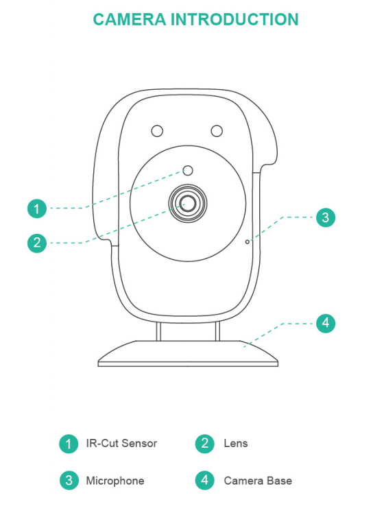
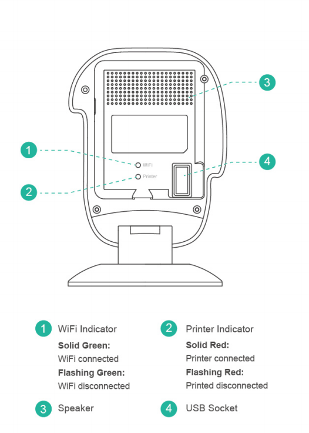
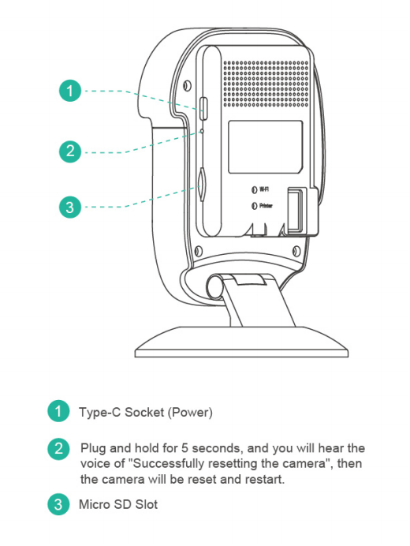

# Camera Introduction

You can learn about the structural components of the Camera through the following content, such as the position and status of the indicator light, the position of the Micro SD card, the power supply port, and the USB Socker.

|--|--|--|
||||

----
### Next: [Install the cable](../Install_the_cable/index.md)
