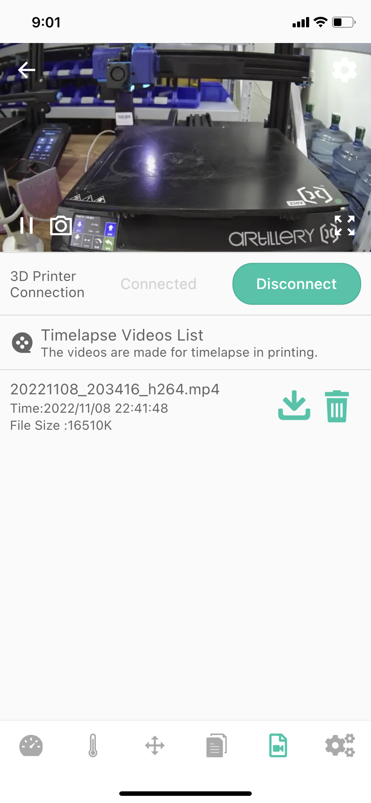
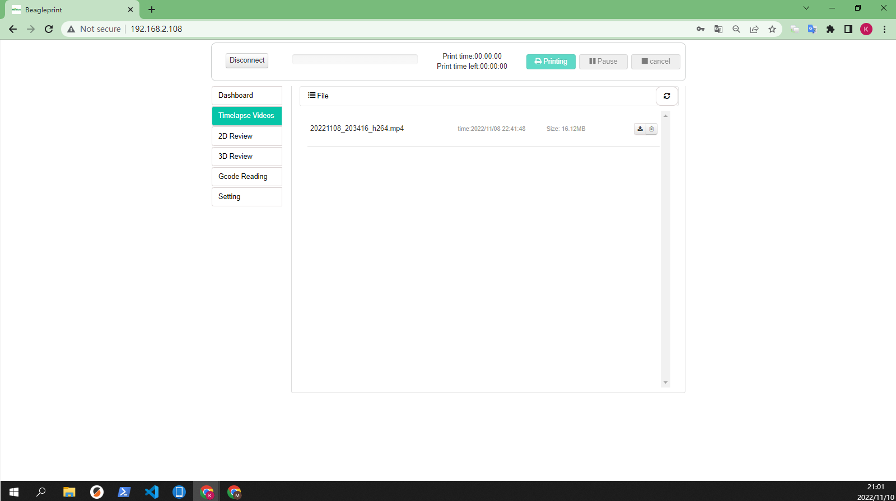

# Download Time Lapse

After printing through Camera, Camera will generate a time-lapse video,
_Note: The default Camera is to enable "Clean Timelapse video" mode_

At the same time, Camera supports two ways to download time-lapse video, through Beagleprint and browser (recommended Google) Web page.[Instructional video](https://www.youtube.com/watch?v=_HuWAhjcNNU&list=PLSc0XAQ8Rossckz3ZaQxcMA49GijutVPY&index=9){: .btn .btn-green .mr-4 }

## Download Time Lapse via Beagleprint app

Find the video list, you can slide to find the time-lapse photography you want to download (videos are sorted according to the generation time), you can see that there are two buttons on the right, download the file and delete the file. Just click the download button.

## Download Time Lapse via PC browser web page

Find the Timelapse Videos, you can scroll the middle of the mouse or click the slider to scroll the list to find the time-lapse photography you want to download (the video is sorted according to the generation time), you can see that there are two buttons on the right, download the file, delete the file document. Just click the download button.

----
### Next: [Get Support](../Get%20Support/index.md)
