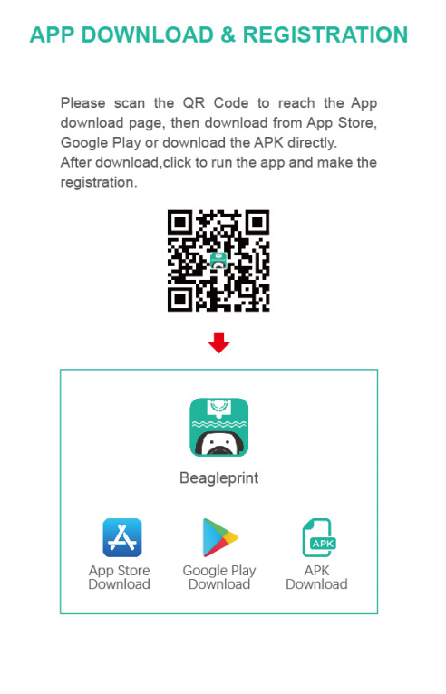
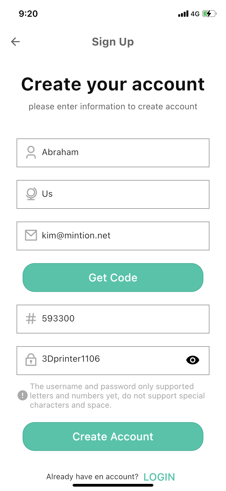
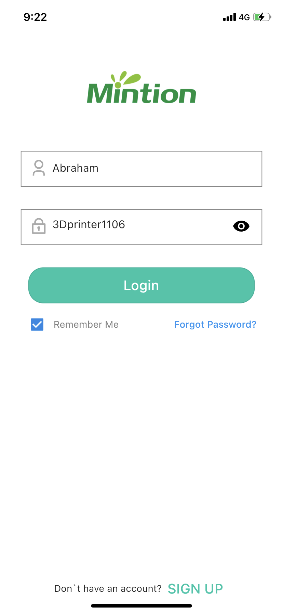

# Beagleprint

Beagleprint is an application with an easy and clean interface to watch the real-time video of your 3d printing and monitor your 3d printer status. With Beagleprint, you would auto-generate pretty cool time-lapse videos without any settings.

## Install Beagleprint

For Apple phones, you can search for "Beagleprint" in the app store to download and install. For Android phones, you can search for "Beagelrpint" in Google Play to download, or download the [APK file](https://www.3dprinteraccessories.shop/pages/download) for installation.[Instructional video](https://www.youtube.com/watch?v=PKNqwQTrR9c&list=PLSc0XAQ8RossfF7Z-SkeIvYP2vs1O8vf-&index=13){: .btn .btn-green .mr-4 }

## Register an account and log in

[Instructional video](https://www.youtube.com/watch?v=0arhcrNvyWE&list=PLSc0XAQ8RossfF7Z-SkeIvYP2vs1O8vf-&index=1){: .btn .btn-green .mr-4 }

| Register | log in |
|--|--|
|||

[Having trouble registering an account?](/Beaglecam/docs/FAQ)

----

### Next: [QR Scan configuration](../Camera_Networking/index.md)

----