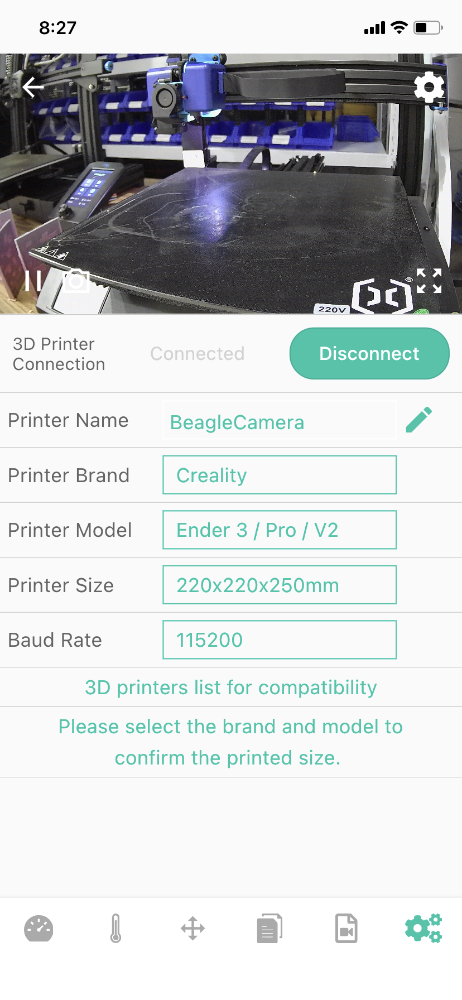
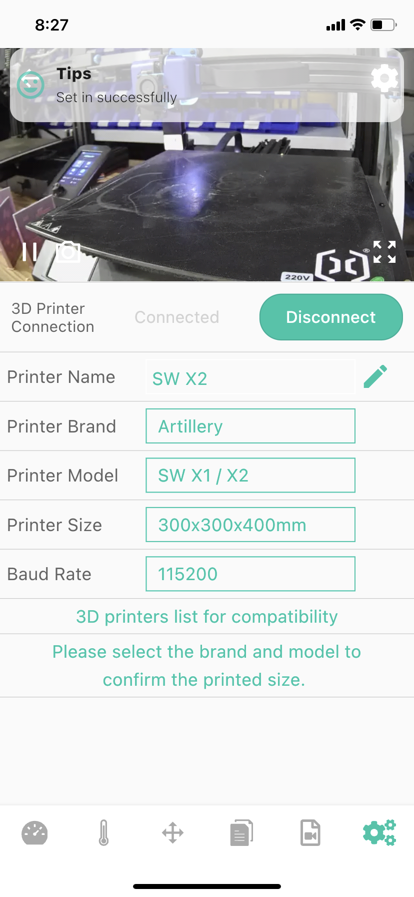

# Set The Printer Model

This setting is mainly to tell Camera the information of the connected printer, so as to ensure that some functions work properly.
Touch and click the newly added Camera, select the setting button in the lower right corner, and input or select parameters by touching and clicking the corresponding "box".[Instructional video](https://youtu.be/D6vVukCDkis){: .btn .btn-green .mr-4 }

_Note: After setting, don't forget to click the save button_

|Before|After|
|-|-|
|||

----
### Next: [Upload Gcode File](../Upload%20Gcode%20File/index.md)
